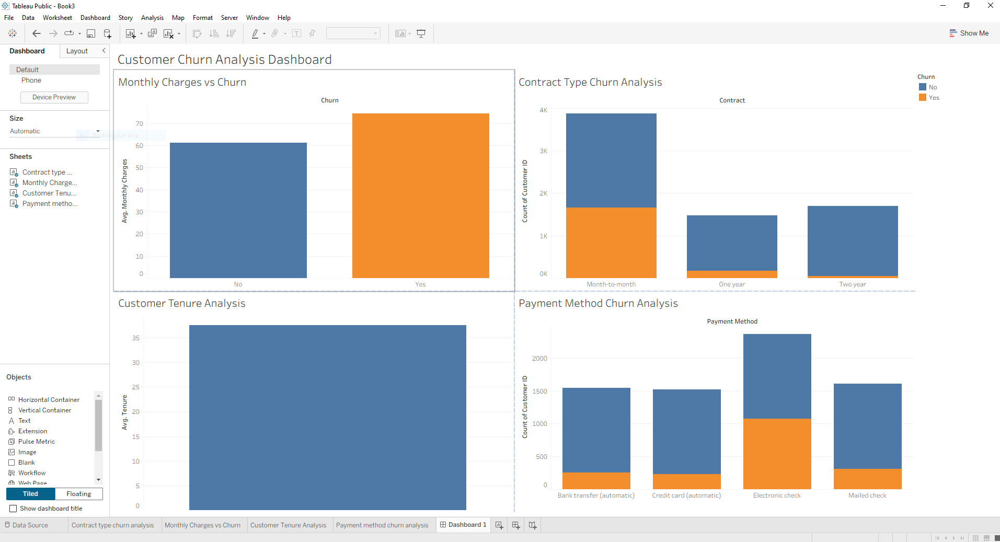

## Dashboard

## Key Insights

- Month-to-month contracts had the highest churn rate (~45%)
- Customers with higher monthly charges were more likely to churn
- Customers who churned had significantly lower average tenure
- Electronic check users showed the highest churn behavior
- Long-term contracts greatly reduced customer churn

# customer-churn-analysis
SQL and Tableau project analyzing customer churn trends and retention insights.
# Customer Churn Analysis

## Project Overview
This project analyzes customer churn trends for a telecommunications company using MySQL and Tableau.

The objective was to identify factors contributing to customer churn and provide business recommendations to improve customer retention.

---

## Tools Used
- MySQL
- Tableau
- GitHub
- CSV Dataset

---

## Dataset
IBM Telco Customer Churn Dataset

---

## Business Questions
- Which customers churn most frequently?
- Does contract type impact churn?
- Do higher monthly charges increase churn risk?
- Which payment methods have the highest churn?

---

## Key Insights

### 1. Contract Type Strongly Impacts Churn
Month-to-month customers had a churn rate of 44.79%, while one-year and two-year contracts had churn rates below 2%.

### 2. High Overall Churn Rate
The company experienced an overall churn rate of 25.08%, indicating retention opportunities.

### 3. Long-Term Contracts Improve Retention
Customers on long-term contracts demonstrated significantly lower churn rates.

---

## Business Recommendations
- Encourage customers to transition to long-term contracts
- Offer retention incentives to high-risk customers
- Improve loyalty programs for month-to-month subscribers

---

## SQL Skills Demonstrated
- Aggregate Functions
- GROUP BY
- CASE Statements
- Data Cleaning
- KPI Calculations

---

### 4. Higher Monthly Charges Increase Churn Risk
Customers who churned had higher average monthly charges compared to retained customers, suggesting pricing may influence customer retention.
Business reccomendation
- Offer loyalty discounts or bundled services to customers with high monthly charges

- ### 5. Early Customer Retention Is Critical
Customers who churned had significantly lower average tenure compared to retained customers, indicating that early customer retention is essential for long-term loyalty.
Business Recommendation
- Develop onboarding and retention programs targeting new customers during their first year

### 6. Payment Method Influences Churn
Customers using electronic check payments demonstrated the highest churn rates, while credit card users showed the lowest churn rates.
---
Business Recommendation
- Encourage customers to enroll in automatic credit card payments to improve retention
## Author
Nicholas Valverde
